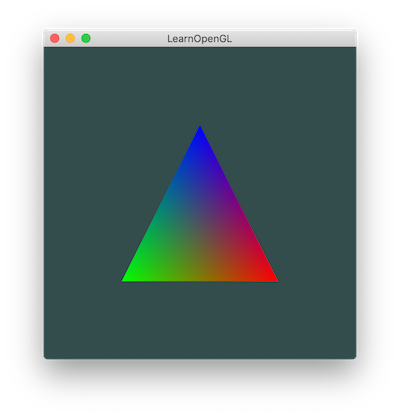
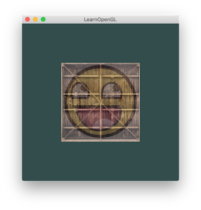

# learn_opengl
Code from [learnopengl.com](learnopengl.com) tutorials

## Tutorials

### Getting started

- [X] [OpenGL](https://learnopengl.com/Getting-started/OpenGL)
- [X] [Creating a window](https://learnopengl.com/Getting-started/Creating-a-window)
- [X] [Hello Window](https://learnopengl.com/Getting-started/Hello-Window)
- [X] [Hello Triangle](https://learnopengl.com/Getting-started/Hello-Triangle)
- [X] [Shaders](https://learnopengl.com/Getting-started/Shaders)
  - 
- [X] [Textures](https://learnopengl.com/Getting-started/Textures)
  - 
- [X] [Transformations](https://learnopengl.com/Getting-started/Textures)
  - 
- [ ] [Coordinate Systems](https://learnopengl.com/Getting-started/Coordinate-Systems)
- [ ] [Camera](https://learnopengl.com/Getting-started/Camera)
- [ ] [Review](https://learnopengl.com/Getting-started/Review)
